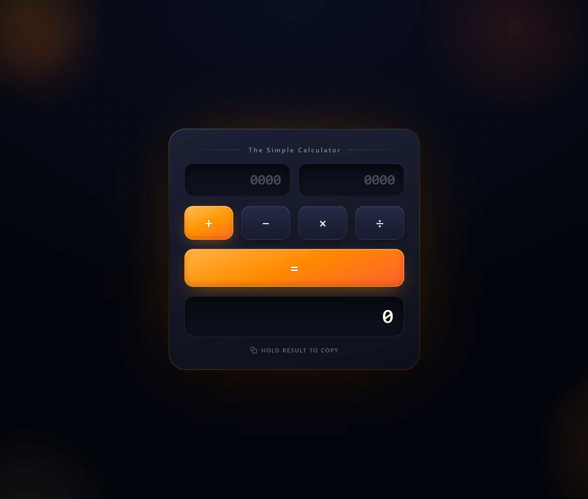

# Simple Calculator

A very simple calculator. While many calculators already exist, this one was created anyway.

You can visit the calculator here!
[enussoul-calculator.netlify.app](https://enussoul-calculator.netlify.app)

## Features

- Two input boxes, with each box allowing up to 4 digits and 4 decimal digits
- +, -, ×, and ÷ operator options
- Simple wide = button
- Interactions with the calculator have sounds, including typing, clicking, holding, copying, and results (because sounds are satisfying)
- Hold the result box for 1.5 seconds to copy the result
- Supports different screen sizes, from small phones to ultrawide monitors

## Status

> [!WARNING]
> This calculator is just basic with some visual aesthetics.

New Update Soon!

## Planned Features

* Increase Digits Limit
* New Themes
* More Functionality

Enjoy your basic calculator!
